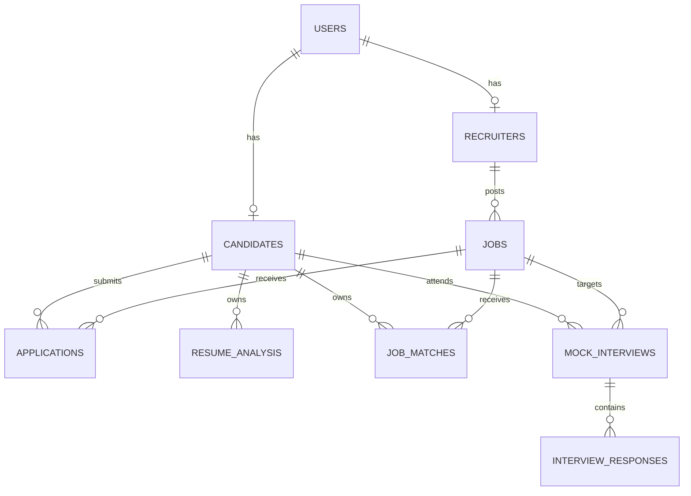

# Entity Relationship Diagram

```mermaid
erDiagram
    USERS ||--o| CANDIDATES : has
    USERS ||--o| RECRUITERS : has
    RECRUITERS ||--o{ JOBS : posts
    CANDIDATES ||--o{ APPLICATIONS : submits
    JOBS ||--o{ APPLICATIONS : receives
    CANDIDATES ||--o{ RESUME_ANALYSIS : owns
    CANDIDATES ||--o{ JOB_MATCHES : owns
    JOBS ||--o{ JOB_MATCHES : receives
    CANDIDATES ||--o{ MOCK_INTERVIEWS : attends
    JOBS ||--o{ MOCK_INTERVIEWS : targets
    MOCK_INTERVIEWS ||--o{ INTERVIEW_RESPONSES : contains
```
